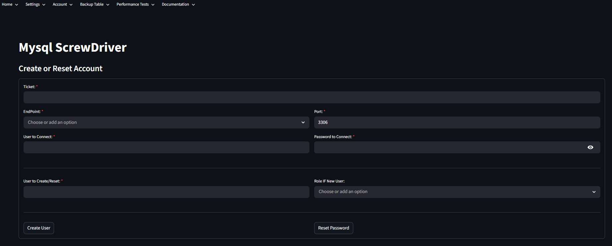
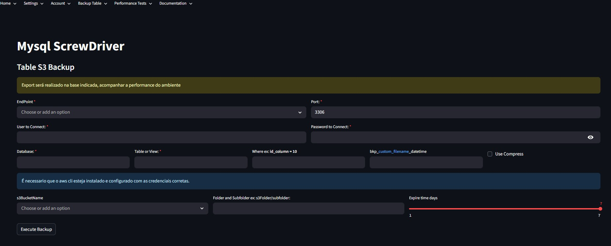
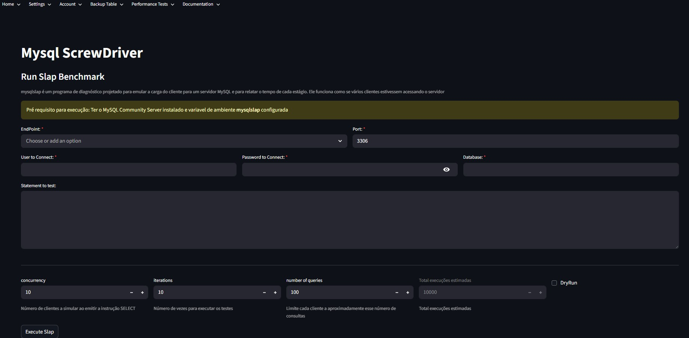

# mysqlscrewdriver

Ferramenta web para servir como uma chave de fenda para MySQL, construída com Python, Streamlit e Docker.

## Funcionalidades

- **Gerenciamento de usuários:** Criação de usuários e reset de senha com mensagens e parâmetros customizáveis.

- **Exportação de tabelas/views:** Exporta tabelas/views do MySQL em CSV localmente ou diretamente para o S3 usando `mysql-shell`.

- **Benchmark (`mysqlslap`):** Testes de performance com mysqlslap.

- **Configurações:** Customizações com interface web simples e intuitiva (Streamlit).

- **Documentação:** (Futuro) Integração com SchemaSpy para geração de documentação do banco.

## Pré-requisitos

- Docker e Docker Compose instalados
- Baixe o mysql-shell versão 8.4 ou superior na raiz do projeto e renomeie o arquivo para `mysql-shell.deb`:
  https://dev.mysql.com/downloads/shell/8.0.html
- Para uso do S3, preencha o arquivo `.env.example` com suas credenciais e renomeie para `.env`.

## Como usar

### Usando Docker

1. **Construa a imagem e execute a app:**
    ```bash
    docker compose up -d --build
    ```
2. **Acesse a interface:**
    Abra [http://localhost:8501](http://localhost:8501) no navegador.
3. **Para interromper a execução:**
    ```bash
    docker compose stop
    ```
4. **Para retomar a execução:**
    ```bash
    docker compose up -d
    ```
5. **Para excluir a imagem:**
    ```bash
    docker compose down
    ```

### Usando Python localmente

1. Crie um novo ambiente virtual:
    ```bash
    python -m venv my_project_env
    ```
2. Ative o ambiente virtual:
    - **Windows:**
      ```bash
      my_project_env\Scripts\activate
      ```
    - **Linux/macOS:**
      ```bash
      source my_project_env/bin/activate
      ```
3. Instale as dependências:
    ```bash
    pip install -r requirements.txt
    ```
4. Execute o app:
    ```bash
    streamlit run app/main.py
    ```

## Estrutura do Projeto


```text
mysqlscrewdriver/
├── app/
│   ├── main.py
│   ├── account/
│   │   └── create_account.py
│   ├── benchmark/
│   │   └── mysqlslap.py
│   ├── config/
│   │   ├── configs.py
│   │   ├── database.db
│   │   ├── functions.py
│   │   └── models.py
│   ├── docs/
│   │   ├── backupcli_S3.jpg
│   │   ├── create_account.jpg
│   │   └── mysqlslap.jpg
│   ├── document/
│   │   └── schemaspy.py
│   ├── exporttable/
│   │   ├── backupcli_local.py
│   │   └── backupcli_S3.py
│   ├── home/
│   │   ├── homepage.md
│   │   └── homepage.py
│   ├── outputdir/
│   │   └── backups.md
│   └── tools/
│       ├── commands.py
│       ├── db.py
│       ├── passgen.py
│       ├── sqllite.py
├── requirements.txt
├── Dockerfile
├── docker-compose.yml
├── mysql-shell.deb
├── LICENSE
└── README.md
```


## Observações

- Os arquivos exportados são salvos em `app/outputdir` ou enviados diretamente para o S3, conforme configuração.
- Certifique-se de que o usuário MySQL informado tem permissão de leitura na tabela/view desejada.
- Para dúvidas ou sugestões, abra uma issue.

---

### Comandos Úteis

- Forçar pull da imagem Ubuntu e recriar containers:
    ```bash
    docker pull ubuntu:24.10
    docker compose up --build --force-recreate
    ```
- Cadastro de host para execução interna:
    ```bash
    host.docker.internal
    ```
- Acesso ao host da app:
    ```bash
    docker run -it mysqlscrewdriver-app /bin/bash
    ```

### Como Contribuir
Se você deseja contribuir com este repositório, siga as etapas abaixo:

Abrir uma issue para discutir a sua contribuição.
Crie um fork do repositório.
Crie uma branch para a sua feature (git checkout -b feature/nome-da-feature).
Faça as alterações necessárias e commit (git commit -m 'Adiciona nova feature').
Envie a branch para o seu fork (git push origin feature/nome-da-feature).
Abra um Pull Request para o repositório original.

---
Feito com ❤️ por Jorge Moraes.